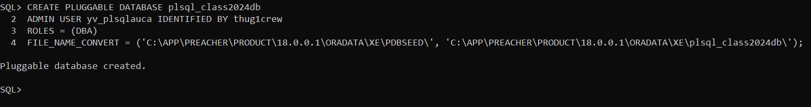
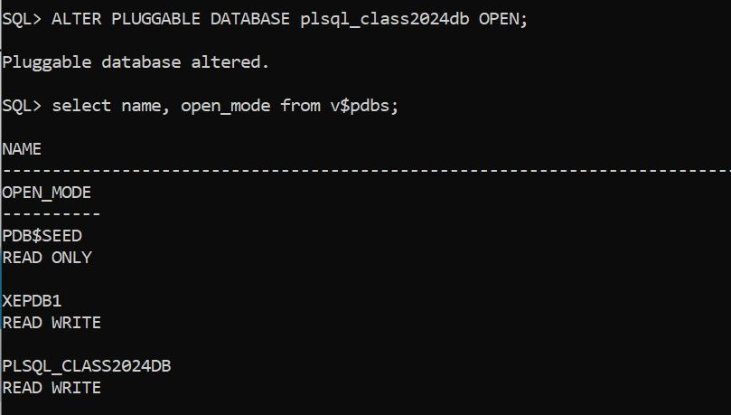
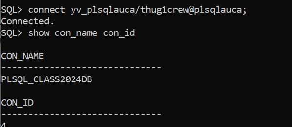
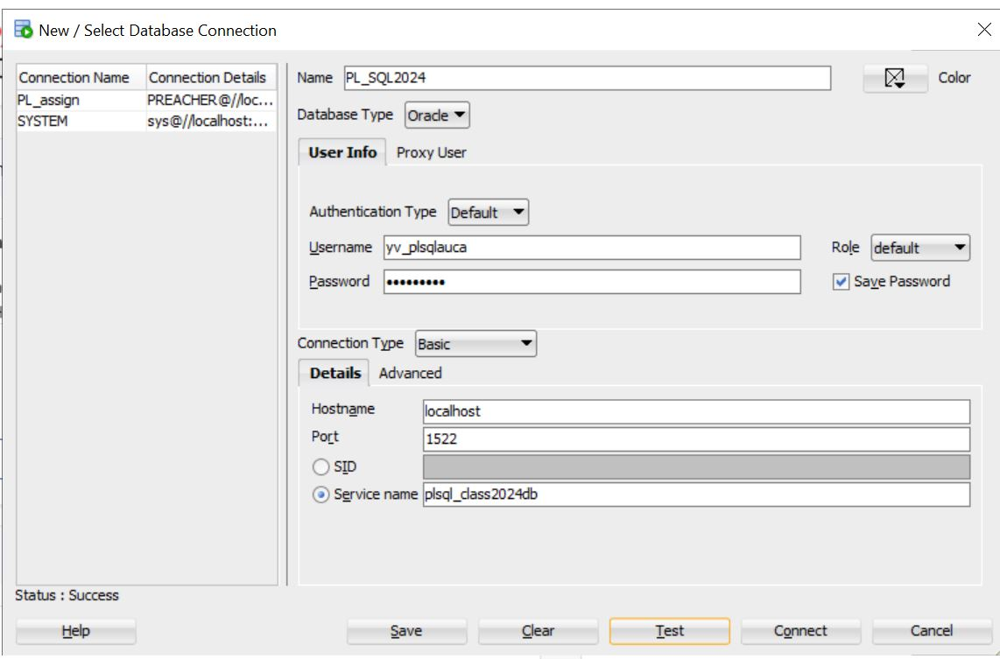
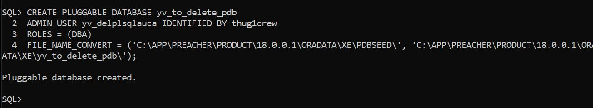

# _**PLUGGABLE DATABASE CREATION AND DELETION**_

The following codes ensures that the creation and deletion of a pluggable database and configuration so that it can be accessed through SQL developer

## **Creating Pluggable Database**

### _Creating_

the first step is to create a directory for the datafiles of your pluggable database

```sql
mkdir C:\APP\PREACHER\PRODUCT\18.0.0.1\ORADATA\XE\plsql_class2024db\;
```
next is to create the Pdb

```sql
CREATE PLUGGABLE DATABASE plsql_class2024db
    ADMIN USER yv_plsqlauca IDENTIFIED BY thug1crew
    ROLES = (DBA)
    FILE_NAME_CONVERT = ('C:\APP\PREACHER\PRODUCT\18.0.0.1\ORADATA\XE\PDBSEED\',
   'C:\APP\PREACHER\PRODUCT\18.0.0.1\ORADATA\XE\plsql_class2024db\');
```


### _Enable for Usage_

When the Pdb is created it cannot be access or used immediately so it is need to be open using the following codes:

```sql

ALTER PLUGGABLE DATABASE plsql_class2024db OPEN;

SELECT name, open_mode from V$PDBS; --- this is to see if it is opened or ready to be used
```


### _Configuration_

Use _Net configuration Assistant_ app found in your machine and follow the the steps:

**step 1**: local net service name configuration

**step 2**: add

**step 3**: Service name : plsql_class2024db

**step 4**: TCP

**step 5**: hostname: localhost, port: 1522

**step 6**: Do the test if u want

**step 7**: give an alias your Pdb for easy access :plsqlauca and finish

And Try to connect using the following codes:

```sql
connect yv_plsqlauca/thug1crew@plsqlauca;

show con_name con_id  --- To show what database it is connect to
```



### _Connect to SQL Developer_



## **Deletion Pluggable Database**

### _create a delete test Pdb_

i will create as show in the above

```sql
CREATE PLUGGABLE DATABASE yv_to_delete_pdb
ADMIN USER yv_delplsqlauca IDENTIFIED BY thug1crew
ROLES = (DBA)
FILE_NAME_CONVERT = ('C:\APP\PREACHER\PRODUCT\18.0.0.1\ORADATA\XE\PDBSEED\', 'C:\APP\PREACHER\PRODUCT\18.0.0.1\ORADATA\XE\yv_to_delete_pdb\');
```


### _Enabale for Usage_

